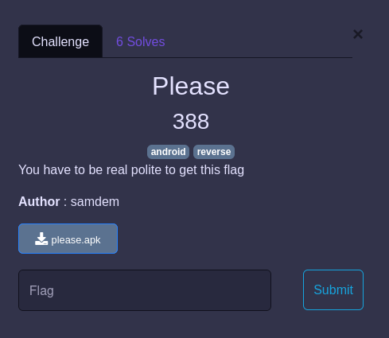
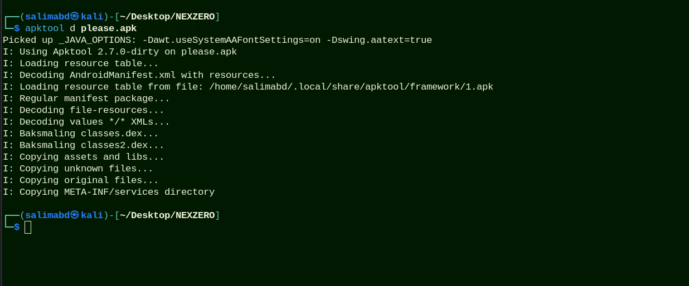
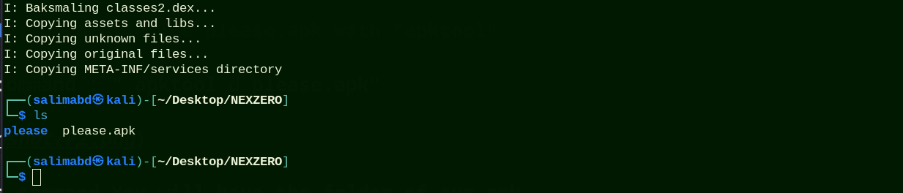
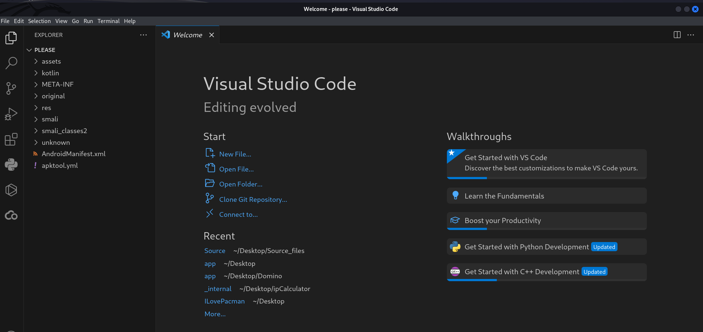
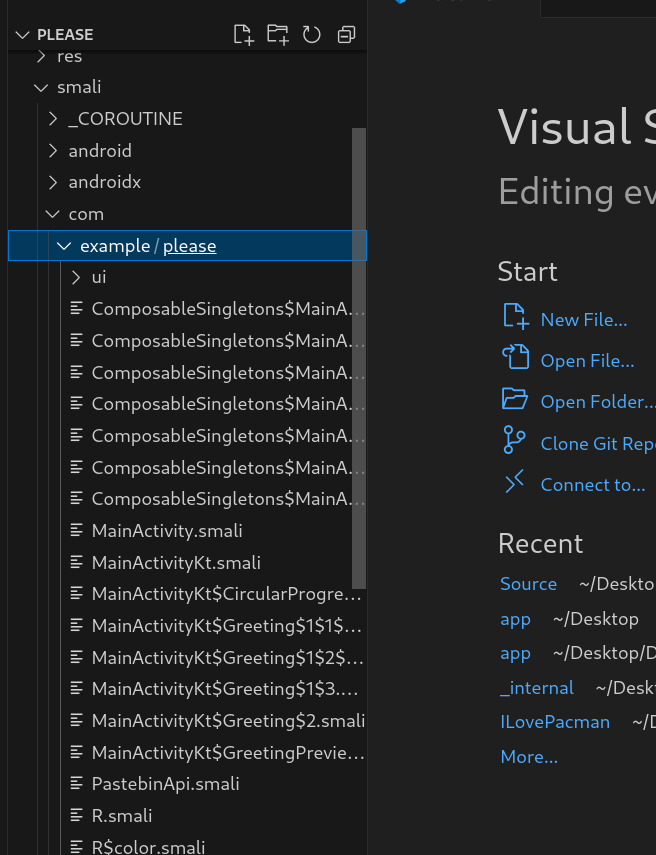
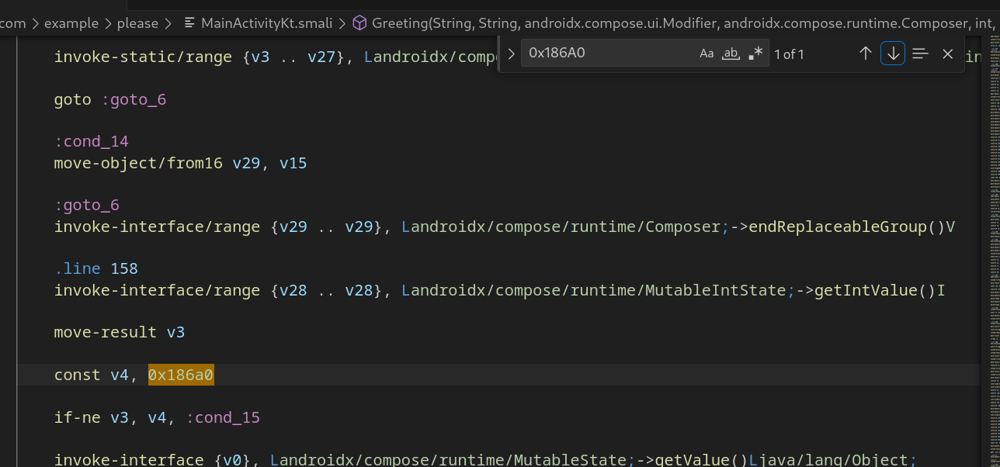
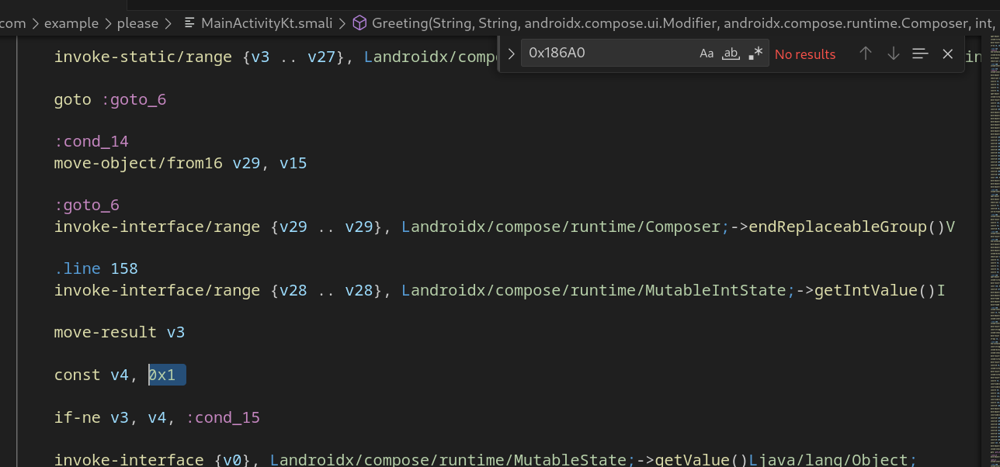
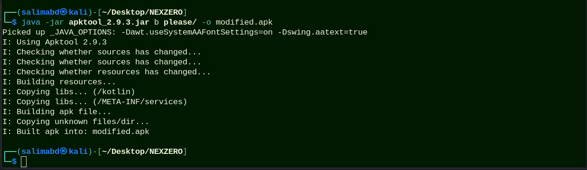
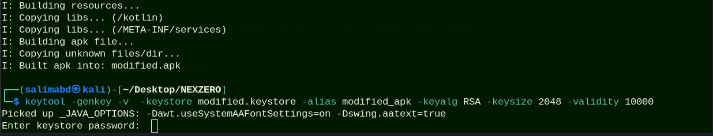
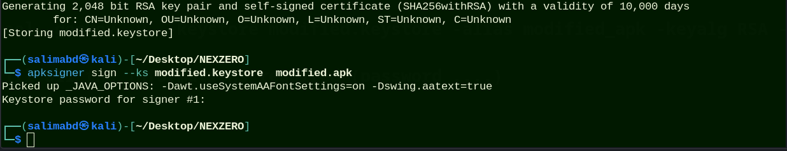

# Please

## Infos About challenge : 

You can solve this challenge localy 

## solution:

### Step 0 : Run the apk in your mobile or emulator 

##### You notice that you should tap please x100000

 

### Step 1 : Decompile The please.apk with "apktool" 

run this command : " apktool d please.apk"

After this command You will have the folder of our apk  

### Step 2 : Open the folder in Vscode  and REVERSE 

Run this command : code please 

#### The equivalent of the assembley code in Kotlin (java) is smali code so we should reverse .smali codes 

So we should open smali/com/example 

  

We should reverse the MainActivityKt.smali

###### 100000 in decimal is : 0x186A0 in Hex : 

so you search in the MainActivityKt.smali where is variable has value : 0x186A0

###### and you change it To 0x1 

  

##### Now you work is done 

###  Step 03  : Build your modified APP 

###### First Download apktool 2.9.3.jar  and move it to Your folder 

build your app by running : " java -jar apktool_2.9.3.jar b please/ -o modified.apk "

###### If you think that you are done you are L0ser

###FINAL Step : Sign you modified app  

Any Mobile app should be signed (certification) 

######## We choose keytool + apksigner tool  To sign our App 

So ypu should this two commands : 

1--  keytool -genkey -v  -keystore modified.keystore -alias modified_apk -keyalg RSA -keysize 2048 -validity 10000
    
    And fill all the informations required (password ....)
    

2-- apksigner sign --ks modified.keystore  modified.apk

And you enter the password of you modified.keystore 

#### Now Congratulation you reversed The app  , Run the App in your phone and the flag is yours 

### flag:

`nexus{p4tch1ng_4pps_15_d0p3}`
